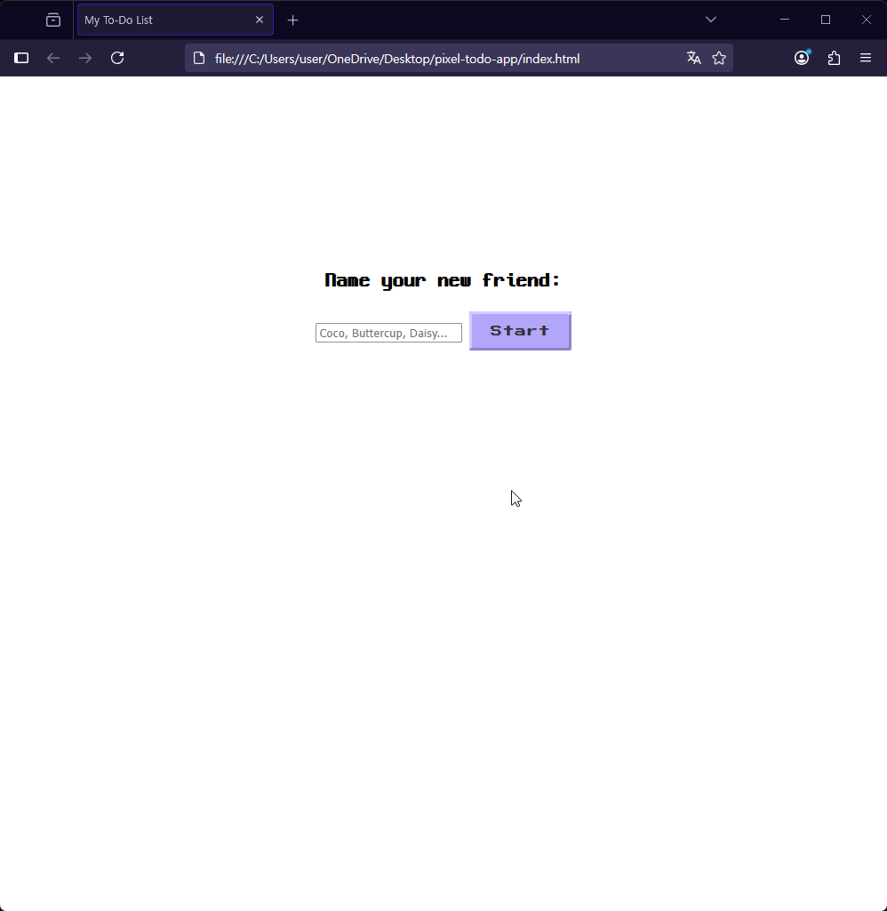

# Pixel Pet Planner (픽셀 펫 플래너) v1.0

> 할 일을 완료하며 나만의 픽셀 펫 '친구'와 교감하고, 감성적인 테마의 방을 함께 꾸며나가는 보상형 투두리스트 웹 애플리케이션입니다.

---

## 데모 (Demo) & 배포 (Deployment)

프로젝트 직접 경험해보기 (Live Demo): https://jay-klmnop.github.io/pixel-todo-app/

---

## 주요 기능 (Key Features)

- **사용자 온보딩 (User Onboarding):** 앱 시작 시 사용자가 자신의 펫에게 직접 이름을 지어주며 첫 '감정적 연결'을 형성합니다.
- **동적 UI:** 사용자가 지어준 이름을 이용해 `[펫이름]'s Room` 과 같이 UI가 동적으로 변경되어 '소유권'을 부여합니다.
- **직관적인 할 일 관리 (CRUD):** 할 일 추가(Create), 완료(Update), 삭제(Delete) 등 핵심적인 관리 기능을 지원합니다. (삭제 기능은 향후 추가 예정)
- **게이미피케이션: 단계별 보상 시스템:** 완료한 할 일 개수에 따라 순차적으로 가구, 배경 등 시각적 보상을 지급하여 지속적인 동기를 부여합니다.
- **내러티브 경험:** 특정 테마의 모든 아이템을 획득하면, 펫이 특별한 '완성 상태' 애니메이션을 보여주며 하나의 스토리를 마무리 짓는 경험을 제공합니다.
- **피드백 시스템:** 아이템 획득 시 하단에 나타나는 알림 메시지를 통해 사용자의 행동에 대한 즉각적인 시각적 피드백을 제공합니다.
- **데이터 영속성:** `localStorage`를 이용해 사용자의 할 일 목록과 펫 이름을 브라우저에 저장하여, 재방문 시에도 데이터가 유지됩니다.

---

## 기술 스택 (Tech Stack)

- **Core:** HTML5, CSS3, JavaScript (ES6+)
- **Styling:** CSS Variables, Media Queries for Responsive Design
- **Art & Design:** Piskel
- **Code Quality:** ESLint, Prettier
- **Version Control:** Git, GitHub

---

## 트러블 슈팅 & 성장 기록 (Troubleshooting & Learnings)

> 이 프로젝트를 진행하며 마주쳤던 문제들과, 이를 해결하며 얻은 깊이 있는 학습 경험을 기록합니다.

### 1. CSS 렌더링 원리: `border-image`가 보이지 않던 문제

- **문제 상황:**
  F12 개발자 도구에 어떠한 에러도 없고 이미지 경로도 정확했으나, `border-image` 속성이 화면에 적용되지 않았습니다.
- **원인 분석:**
  `border-image`는 `border-style` 속성이 `none`(기본값)일 경우, 테두리를 그릴 '공간' 자체가 없다고 판단하여 렌더링되지 않는다는 사실을 발견했습니다.
- **해결 과정:**
  `border-style: solid;`를 명시적으로 추가하여 브라우저가 테두리를 렌더링하도록 '스위치'를 켜주었고, 이를 통해 `border-image`가 정상적으로 표시되도록 해결했습니다.
- **핵심 학습:**
  CSS 속성들이 서로 어떻게 의존하고 영향을 미치는지, 특히 **CSS 렌더링의 기본 원리**에 대해 깊이 이해하게 되었습니다.

### 2. 레이아웃 무결성: Flexbox를 이용한 컨텐츠 분리

- **문제 상황:**
  할 일 텍스트(``)가 길어져 줄바꿈 될 때, 체크박스 역할을 하는 `::before` 가상 요소의 아래 공간을 침범하는 레이아웃 깨짐 현상이 발생했습니다.
- **원인 분석:**
  `<li>` 내부 요소들이 기본적인 `inline` 흐름을 따라, 텍스트가 공간 전체를 차지하려 했기 때문입니다.
- **해결 과정:**
  부모 요소인 `<li>`에 `display: flex;`와 `align-items: center;`를 적용했습니다. 이를 통해 `::before`와 ``을 **독립적인 '플렉스 아이템'으로 분리**하여, 각자의 영역을 유지하며 수직 중앙 정렬되도록 구조를 개선했습니다.
- **핵심 학습:**
  `Flexbox`가 단순히 아이템을 정렬하는 도구를 넘어, **컨텐츠 영역을 논리적으로 분리하여 레이아웃의 무결성(Integrity)을 지키는** 데 얼마나 강력하고 필수적인지 체감했습니다.

### 3. 데이터 영속성: `localStorage`와 데이터 중심 설계

- **문제 상황:**
  새로고침 시 사용자가 입력한 모든 할 일과 펫 이름, 획득한 아이템 정보가 초기화되었습니다.
- **원인 분석:**
  애플리케이션의 모든 상태(State)가 메모리(JS 변수)에만 저장되어, 페이지가 리로드될 때 소실되는 근본적인 문제가 있었습니다.
- **해결 과정:**
  - **데이터와 뷰의 분리:** 화면(View)을 직접 조작하는 대신, `todos` 배열이라는 **'원본 데이터(Model)'**를 중심으로 애플리케이션을 재설계했습니다.
  - **`localStorage` 도입:** 사용자의 행동(추가, 완료)이 발생할 때마다, 이 `todos` 배열을 `JSON.stringify()`를 통해 직렬화하여 `localStorage`에 저장했습니다.
  - **초기화 로직:** 앱 시작 시 `localStorage`에서 데이터를 다시 불러와 `JSON.parse()`로 역직렬화하고, 그 데이터를 기반으로 `render()` 함수가 화면 전체를 그리도록 구현했습니다.
- **핵심 학습:**
  데이터 영속성(Data Persistence)의 중요성을 깨닫고, **데이터 중심 아키텍처**를 통해 단순한 '웹페이지'를 사용자의 데이터가 유지되는 진정한 **'웹 애플리케이션'으로 전환하는 방법**을 학습했습니다.

### 4. (Special) 반응형 스케일링: 복합적 버그와의 사투

- **문제 상황:**
  화면 크기에 따라 펫과 가구의 크기를 동적으로 조절하는 로직이, 특정 상황에서 작동하지 않거나, 오작동하거나, 전혀 반응하지 않는 등 복합적이고 예측 불가능한 버그가 발생했습니다.
- **원인 분석 (다층적 원인):**
  - **CSS 명시도(Specificity) 충돌:** ID 선택자(`#cat`)의 스타일이 클래스 선택자(`.character-item`)나 JS의 인라인 스타일을 예기치 않게 덮어쓰는 문제.
  - **JavaScript 실행 시점(Timing) 오류:** `DOMContentLoaded` 이벤트가 발생하기 전에 DOM 요소를 찾으려 시도하여 `null` 참조 에러가 발생하거나, 이벤트 리스너가 등록되지 않는 문제.
  - **렌더링 기준점의 오류:** 크기가 고정된 자식 요소를 기준으로 삼아, 부모의 `resize` 이벤트가 무의미해지는 논리적 모순.
- **해결 과정:**
  - **체계적 디버깅:** `console.log`를 각 로직의 입구와 출구에 배치하여 코드의 실행 흐름과 변수 값을 실시간으로 추적했습니다.
  - **개발자 도구 심층 활용:** 'Elements' 탭에서 실제 적용된 스타일을, 'Computed' 탭에서 최종 렌더링 값을 역추적하며 CSS 충돌의 원인을 규명했습니다.
  - **전략적 타협:** 완벽한 실시간 반응형 대신, **CSS 변수와 미디어 쿼리**를 조합하여 여러 화면 크기에 대응하는 '계단식 스케일링' 방식을 채택, **프로젝트의 안정성과 디자인의 완성도를 모두 잡는** 현실적인 트레이드오프를 결정했습니다.
- **핵심 학습:**
  - 코딩은 단순히 코드를 작성하는 것이 아니라, **CSS 렌더링, JS 실행 컨텍스트, 브라우저의 이벤트 루프가 얽힌 복잡한 시스템을 이해하고 디버깅하는 과정**임을 온몸으로 체감했습니다.
  - '가설 -> 실험 -> 검증'으로 이어지는 **체계적인 디버깅 프로세스**의 중요성을 깨달았으며, 어떤 문제든 결국 해결할 수 있다는 자신감을 얻었습니다.

---

## 앞으로의 계획 (Future Plans)

- [ ] **보상 시스템 고도화:** 현재의 보상 지급 로직을 개선하여 더 정교한 조건과 다양한 보상 유형을 추가할 계획입니다.
- [ ] **React & TypeScript 리팩토링:** Vanilla JS로 구현된 프로젝트를 컴포넌트 기반 아키텍처로 재구성하여 유지보수성과 확장성을 향상시킬 것입니다. (상태 관리 라이브러리 도입 고려)
- [ ] **백엔드 도입 (BaaS):** Firebase와 같은 서비스를 이용해 사용자 계정 시스템과 클라우드 데이터 저장을 구현하여, 여러 기기에서 동기화가 가능하도록 개선할 것입니다.
- [ ] **다양한 테마 추가:** '마녀의 방', '네온 사이버펑크' 등 사용자가 해금하고 꾸밀 수 있는 새로운 테마들을 추가할 예정입니다.
- [ ] **고급 기능 추가:** 전체 진행 상황 리셋, 테마 전환, 미니 캘린더 등 편의 기능을 확장할 계획입니다.
